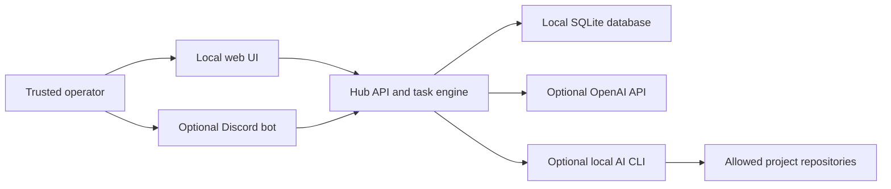
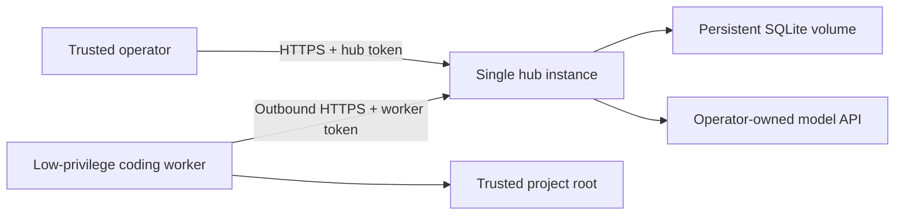

# Architecture

SembleOps is a single-operator application with a deterministic task engine and optional model-backed workers. It can run entirely on one trusted machine or split into an always-on hub and an outbound worker near local code repositories.

## Components

| Component | Responsibility | Trust level |
|---|---|---|
| Web UI | Capture, review, settings, and task actions | Trusted operator browser |
| Discord bot | Optional private capture and notifications | Trusted operator plus Discord |
| HTTP API | UI routes and the remote-worker protocol | Bearer-token protected when networked |
| Task engine | State transitions, scheduling, reminders, and delivery records | Deterministic application code |
| Router and agents | Classification, drafting, research, review, and delegation | Model output is untrusted until reviewed |
| Runtime adapter | OpenAI API or locally authenticated CLI execution | Provider or CLI boundary |
| Coding worker | Runs coding delegations inside configured project boundaries | High privilege within allowed repositories |
| SQLite | Tasks, settings, delegations, output, and audit metadata | Sensitive local state |

## Local mode

In the default layout, all components run under one operating-system account and the server binds to loopback.

This mode has the smallest network attack surface. The current operating-system user remains the effective security boundary for local files.

## Hub-plus-worker mode

An always-on hub can host reminders, the UI, Discord, SQLite, and API-backed read-only agents. A separate worker polls the hub over HTTPS, claims coding jobs, executes them on a machine with local repositories, and posts results back.

The hub does not need a mounted copy of the code repositories in this mode. The worker token authorizes the worker protocol; it is not a general user identity. Keep `HUB_ACCESS_TOKEN` and `WORKER_TOKEN` distinct.

## Task and delegation flow

1. The operator submits text through the UI or Discord.
2. The router classifies the input and records deterministic actions or queues agent work.
3. The task engine owns task state, deadlines, snoozes, blocked checks, and reminder timing.
4. An available runtime executes queued model work.
5. Results are stored for review. Selected outputs may trigger a separate verification delegation.
6. The operator accepts, retries, edits, or rejects the result.

Model output never becomes inherently trustworthy because it came from a named persona. Prompts, generated content, facts, links, and code all require review appropriate to their impact.

## Storage

SQLite is the system of record. Runtime paths are configured in `config/sembleops.yaml`, and local runtime data belongs under the ignored `data/` directory by default.

SembleOps is designed around one SQLite writer and one hub process. Do not horizontally scale the hub or attach multiple independent writers to the same database. Use encrypted backups and test restoration.

## Runtime selection and cost ownership

Supported runtime adapters are configured by the operator. API-backed work uses the operator's `OPENAI_API_KEY`. CLI-backed work uses the CLI authentication available to the operating-system account running SembleOps.

The project does not broker accounts, keys, credits, subscriptions, or hosting. Local cost records are informational; provider-side budgets and alerts remain the authoritative control.

## Extension points

- Persona names, descriptions, colors, and scopes live in `config/personas.yaml`.
- Node, timing, storage, server, and runtime choices live in `config/sembleops.yaml`.
- Runtime adapters isolate provider- or CLI-specific invocation.
- Database changes use ordered migrations.

Changes that add connectors, autonomous write actions, network exposure, or stored personal data must update [the threat model](threat-model.md) and [data documentation](data-and-privacy.md).

## Deliberate constraints

- One trusted operator, not tenant isolation.
- One hub process and SQLite writer.
- No built-in public signup or shared hosted service.
- No guarantee that generated content or code is correct or safe.
- No guarantee that a local CLI runtime is sandboxed beyond the controls that CLI and operating system provide.
